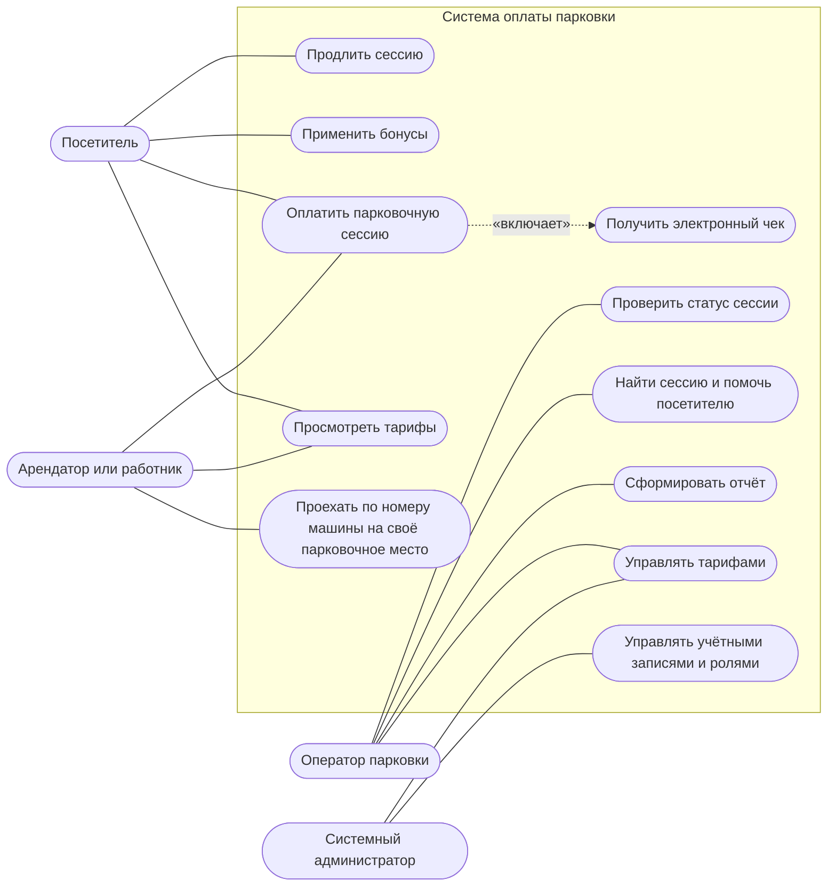

```mermaid
flowchart LR
    visitor([Посетитель])
    tenant([Арендатор или работник])
    operator([Оператор парковки])
    admin([Системный администратор])

    subgraph system["Система оплаты парковки"]
        extend(["Продлить сессию"])
        bonus(["Применить бонусы"])
        pay(["Оплатить парковочную сессию"])
        receipt(["Получить электронный чек"])
        tariffs_view(["Просмотреть тарифы"])
        drive(["Проехать по номеру машины на своё парковочное место"])
        status(["Проверить статус сессии"])
        help(["Найти сессию и помочь посетителю"])
        report(["Сформировать отчёт"])
        tariffs_manage(["Управлять тарифами"])
        accounts(["Управлять учётными записями и ролями"])
    end

    visitor --- extend
    visitor --- bonus
    visitor --- pay
    visitor --- tariffs_view

    tenant --- pay
    tenant --- tariffs_view
    tenant --- drive

    operator --- status
    operator --- help
    operator --- report
    operator --- tariffs_manage

    admin --- tariffs_manage
    admin --- accounts

    pay -.->|«включает»| receipt
```
