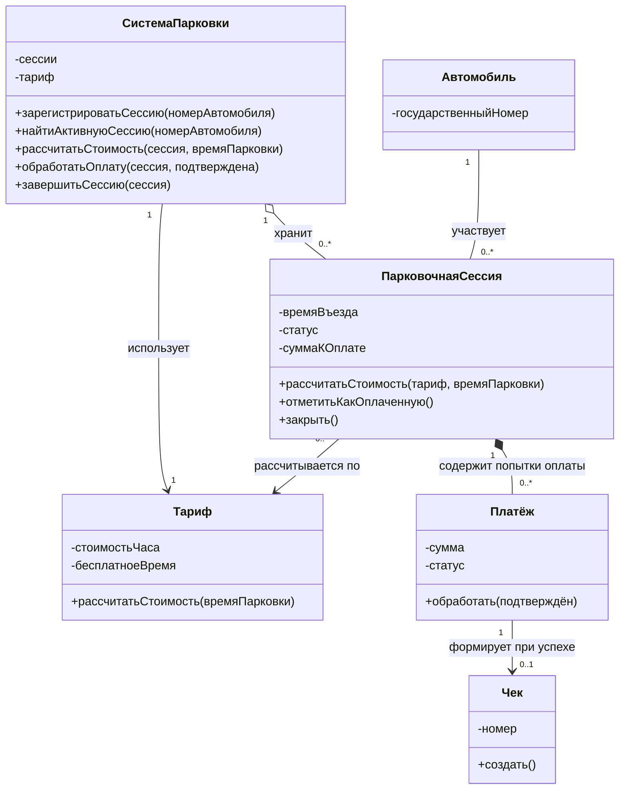

#диаграмма классов

```mermaid
classDiagram
    class СистемаПарковки {
        -сессии
        -тариф
        +зарегистрироватьСессию(номерАвтомобиля)
        +найтиАктивнуюСессию(номерАвтомобиля)
        +рассчитатьСтоимость(сессия, времяПарковки)
        +обработатьОплату(сессия, подтверждена)
        +завершитьСессию(сессия)
    }

    class Автомобиль {
        -государственныйНомер
    }

    class ПарковочнаяСессия {
        -времяВъезда
        -статус
        -суммаКОплате
        +рассчитатьСтоимость(тариф, времяПарковки)
        +отметитьКакОплаченную()
        +закрыть()
    }

    class Тариф {
        -стоимостьЧаса
        -бесплатноеВремя
        +рассчитатьСтоимость(времяПарковки)
    }

    class Платёж {
        -сумма
        -статус
        +обработать(подтверждён)
    }

    class Чек {
        -номер
        +создать()
    }

    СистемаПарковки "1" o-- "0..*" ПарковочнаяСессия : хранит
    СистемаПарковки "1" --> "1" Тариф : использует
    Автомобиль "1" -- "0..*" ПарковочнаяСессия : участвует
    ПарковочнаяСессия "0..*" --> "1" Тариф : рассчитывается по
    ПарковочнаяСессия "1" *-- "0..*" Платёж : содержит попытки оплаты
    Платёж "1" --> "0..1" Чек : формирует при успехе
```
