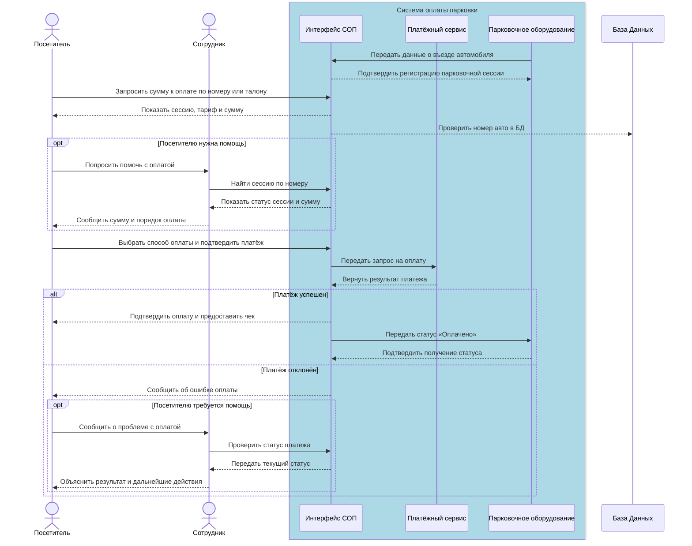

```mermaid
sequenceDiagram
    actor Посетитель
    actor Сотрудник
    
    box lightblue Система оплаты парковки
    participant Система as Интерфейс СОП
    participant ПлатёжныйСервис as Платёжный сервис
    participant Оборудование as Парковочное оборудование
    end
    participant База Данных
    Оборудование->>Система: Передать данные о въезде автомобиля
    Система-->>Оборудование: Подтвердить регистрацию парковочной сессии

    Посетитель->>Система: Запросить сумму к оплате по номеру или талону
    Система-->>Посетитель: Показать сессию, тариф и сумму
    Система-->>База Данных: Проверить номер авто в БД

    opt Посетителю нужна помощь
        Посетитель->>Сотрудник: Попросить помочь с оплатой
        Сотрудник->>Система: Найти сессию по номеру
        Система-->>Сотрудник: Показать статус сессии и сумму
        Сотрудник-->>Посетитель: Сообщить сумму и порядок оплаты
    end

    Посетитель->>Система: Выбрать способ оплаты и подтвердить платёж
    Система->>ПлатёжныйСервис: Передать запрос на оплату
    ПлатёжныйСервис-->>Система: Вернуть результат платежа
    

    alt Платёж успешен
        Система-->>Посетитель: Подтвердить оплату и предоставить чек
        Система->>Оборудование: Передать статус «Оплачено»
        Оборудование-->>Система: Подтвердить получение статуса
    else Платёж отклонён
        Система-->>Посетитель: Сообщить об ошибке оплаты
        opt Посетителю требуется помощь
            Посетитель->>Сотрудник: Сообщить о проблеме с оплатой
            Сотрудник->>Система: Проверить статус платежа
            Система-->>Сотрудник: Передать текущий статус
            Сотрудник-->>Посетитель: Объяснить результат и дальнейшие действия
        end
    end
```
