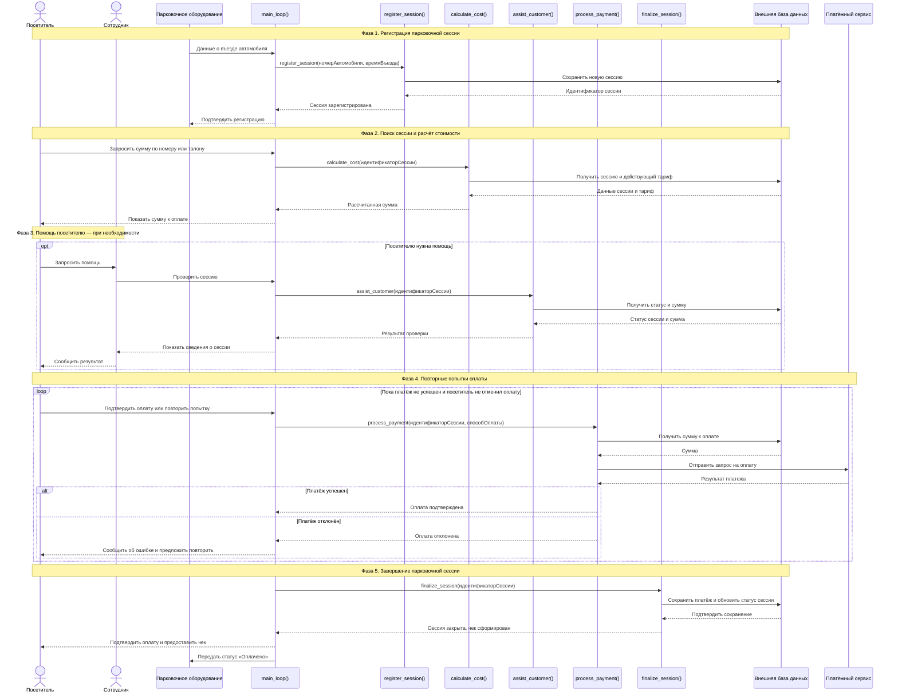

```mermaid
sequenceDiagram
    actor Посетитель
    actor Сотрудник
    participant Оборудование as Парковочное оборудование
    participant main_loop as main_loop()
    participant register_session as register_session()
    participant calculate_cost as calculate_cost()
    participant assist_customer as assist_customer()
    participant process_payment as process_payment()
    participant finalize_session as finalize_session()
    participant БД as Внешняя база данных
    participant ПлатёжныйСервис as Платёжный сервис

    Note over Посетитель,БД: Фаза 1. Регистрация парковочной сессии
    Оборудование->>main_loop: Данные о въезде автомобиля
    main_loop->>register_session: register_session(номерАвтомобиля, времяВъезда)
    register_session->>БД: Сохранить новую сессию
    БД-->>register_session: Идентификатор сессии
    register_session-->>main_loop: Сессия зарегистрирована
    main_loop-->>Оборудование: Подтвердить регистрацию

    Note over Посетитель,БД: Фаза 2. Поиск сессии и расчёт стоимости
    Посетитель->>main_loop: Запросить сумму по номеру или талону
    main_loop->>calculate_cost: calculate_cost(идентификаторСессии)
    calculate_cost->>БД: Получить сессию и действующий тариф
    БД-->>calculate_cost: Данные сессии и тариф
    calculate_cost-->>main_loop: Рассчитанная сумма
    main_loop-->>Посетитель: Показать сумму к оплате

    Note over Посетитель,Сотрудник: Фаза 3. Помощь посетителю — при необходимости
    opt Посетителю нужна помощь
        Посетитель->>Сотрудник: Запросить помощь
        Сотрудник->>main_loop: Проверить сессию
        main_loop->>assist_customer: assist_customer(идентификаторСессии)
        assist_customer->>БД: Получить статус и сумму
        БД-->>assist_customer: Статус сессии и сумма
        assist_customer-->>main_loop: Результат проверки
        main_loop-->>Сотрудник: Показать сведения о сессии
        Сотрудник-->>Посетитель: Сообщить результат
    end

    Note over Посетитель,ПлатёжныйСервис: Фаза 4. Повторные попытки оплаты
    loop Пока платёж не успешен и посетитель не отменил оплату
        Посетитель->>main_loop: Подтвердить оплату или повторить попытку
        main_loop->>process_payment: process_payment(идентификаторСессии, способОплаты)
        process_payment->>БД: Получить сумму к оплате
        БД-->>process_payment: Сумма
        process_payment->>ПлатёжныйСервис: Отправить запрос на оплату
        ПлатёжныйСервис-->>process_payment: Результат платежа

        alt Платёж успешен
            process_payment-->>main_loop: Оплата подтверждена
        else Платёж отклонён
            process_payment-->>main_loop: Оплата отклонена
            main_loop-->>Посетитель: Сообщить об ошибке и предложить повторить
        end
    end

    Note over Посетитель,БД: Фаза 5. Завершение парковочной сессии
    main_loop->>finalize_session: finalize_session(идентификаторСессии)
    finalize_session->>БД: Сохранить платёж и обновить статус сессии
    БД-->>finalize_session: Подтвердить сохранение
    finalize_session-->>main_loop: Сессия закрыта, чек сформирован
    main_loop-->>Посетитель: Подтвердить оплату и предоставить чек
    main_loop->>Оборудование: Передать статус «Оплачено»
```
