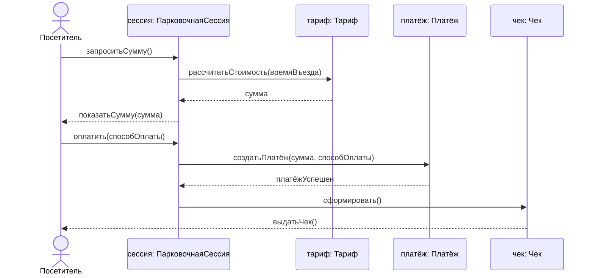

# диаграмма последовательности для конкретного частного сценария

```mermaid
sequenceDiagram
    actor посетитель as Посетитель
    participant сессия as сессия: ПарковочнаяСессия
    participant тариф as тариф: Тариф
    participant платёж as платёж: Платёж
    participant чек as чек: Чек

    посетитель->>сессия: запроситьСумму()
    сессия->>тариф: рассчитатьСтоимость(времяВъезда)
    тариф-->>сессия: сумма
    сессия-->>посетитель: показатьСумму(сумма)

    посетитель->>сессия: оплатить(способОплаты)
    сессия->>платёж: создатьПлатёж(сумма, способОплаты)
    платёж-->>сессия: платёжУспешен
    сессия->>чек: сформировать()
    чек-->>посетитель: выдатьЧек()
```
